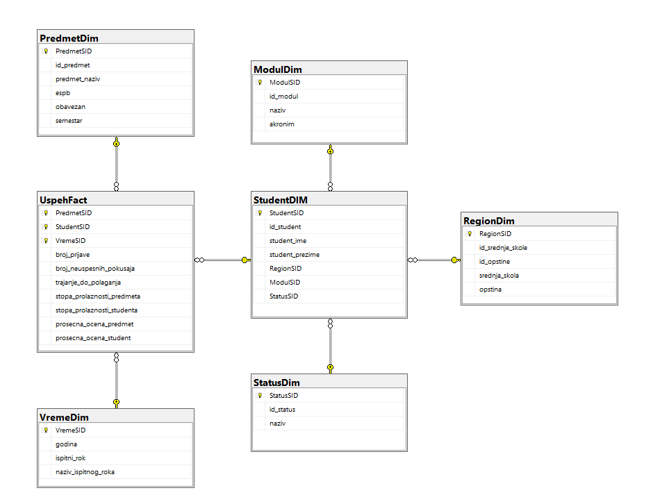

# Student Records Data Warehouse (DW-Student)

## Overview
A data warehouse built in Microsoft SQL Server to track academic records - student performance, module results, and course statistics. The goal was to make that data easy to query and actually useful for analysis.

## Data Model
The schema follows a snowflake structure, which meant normalizing the dimensions further than a standard star schema to cut down on redundancy.

The central fact table is `UspehFact`, which holds the core numbers: exam attempts, pass rates, and average grades. Off of that sits `StudentDIM` as the main dimension, which branches into three sub-dimensions - `RegionDim`, `ModulDim`, and `StatusDim`. The two direct dimensions are `PredmetDim` (course info like ESPB credits and semester) and `VremeDim` (academic years and exam periods).

## Technologies
* Microsoft SQL Server
* SQL Server Management Studio (SSMS)
  
## Database Diagram

